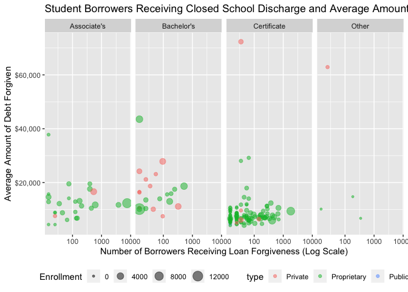

    library(ggplot2)
    closures_recent<-read.csv("~/Desktop/Stat 479/Final-Project/Data/closures_recent")

    p<-ggplot(closures_recent, mapping=aes(x=discharged_borrowers, y=average_discharge)) 
    p + geom_point(aes(color=type, size=Enrollment), alpha=0.5) + facet_grid(.~level2) + scale_x_log10() + scale_y_continuous(labels=scales::dollar)  + theme(legend.position = "bottom") +
      guides(color = "legend") + labs(title="Student Borrowers Receiving Closed School Discharge and Average Amounts", x="Number of Borrowers Receiving Loan Forgiveness (Log Scale)", y="Average Amount of Debt Forgiven") +
      scale_fill_discrete(name="Institutional Control",labels=c("Private Nonprofit", "Private For-Profit", "Public"))

