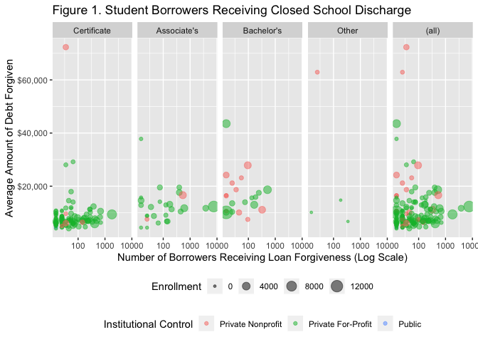

*“Happy \[colleges\] are all alike; every unhappy \[college\] is unhappy
in its own way.” -Tolstoy, Kind Of.*

College closures, while relatively rare events, have dramatic
consequences for their local communities, and are particularly
devastating for current students who must scramble to make plans to
transfer their credits to a different institution or decide to forgo
further education.1 In some cases, institutions are able to
support their students through this transition by developing “teach-out”
plans where a nearby institution agrees to accept transfer credits from
all current students, or to stay in operation while current students
finish their degrees. However, not all students make use of their
options, and some institutions–most notably the high-profile closures of
large for-profit chains such as Corinthian Colleges, ITT Technical
Institute, and others–close suddenly and without adequate support in
place for students to transfer credits. For students who have borrowed
federal loans, those who do not finish their degree are eligible for a
“closed-school discharge,” which means any loans incurred for the
degree-program in question are cancelled. Because of the high costs to
taxpayers and difficulty for students in navigating their options,
policy makers in recent years have begun to pay particular attention to
the issue of sudden school closures. In light of the recent COVID-19
pandemic, several colleges (including Holy Family College in Manitowoc)
have already announced that they will not be able to stay open this fall
and it is likely that many more will follow.

Given the diversity of higher education institutions in the U.S., it is
likely that there are different routes to closure based on the
institutional characteristics and student demographics of a particular
school. In addition, a better understanding of these pathways can help
inform policy and practice to prevent closures in the first place. To
shed light on the pathways to closure, this project uses data from the
U.S. Department of Education’s Federal Student Aid Data Center, which
describes school-level information on the number of students who have
received closed-school discharges and the total amount of loan debt
forgiven for all schools where a loan has been discharged since
2013.2 This data is merged with institutional records from
the College Scorecard, the most comprehensive source of information on
colleges in the United States, including details on the institutional
characteristics, student enrollment and demographics, field of study and
level of degree programs offered, tuition and financial aid available,
loan borrowing and repayment metrics, degree completion rates, and
average earnings of former students.3 Because the year an
institution closed is not readily available, this analysis uses the most
recent year of data in which closed schools appear in the College
Scorecard.

*Figure 1* shows all 161 institutions where students have successful
claimed a closed-school discharge since 2013. The x-axis shows the
number of borrowers who received a student loan discharge at their
higher education institution, while the y-axis shows the average amount
of debt forgiveness received for each borrower. The school closure data
is merged with infromation from the College Scorecard from the last year
in which a school was operating, which enables a comparison of these
outcomes across institution types. From this merged data, *Figure 1*
also displays selected characteristics about the institutions where
those borrowers were enrolled.

The figure shows that borrowers who received forgiveness were
overwhelmingly enrolled in for-profit institutions, while a number of
private non-profit institutions at the four-year level have also closed.
Borrowers are also concentrated at institutions who primarily award
Certificates, and these students typically receive smaller amounts of
forigveness compared to those at institutions who primarily award
Associate’s or Bachelor’s degrees.

In order to identify more distinct patterns among institutions where
students have received closed school discharges, this analysis employs
K-means clustering. The Scorecard data requires some preparation before
a K-means clustering model can be run. The data are first standardized
to have a mean of zero and a standard deviation of one, and missing data
are set to the mean value of that variable. Scorecard data are reported
annually, however because not all data elements are collected every
year, the files contain missing values for all schools for some
variables. Variables for which all observations are missing are dropped.
In addition, some schools do not have valid values for all variables
because a particular data element is inapplicable, such as variables
that apply only to four-year institutions or public schools. In other
cases, data is not reported for schools or groups of students within
schools if small sample sizes are determined to threaten student
privacy. In addition, some variables that serve to identify institutions
such as the school name, website information, and other duplicative
identifiers are dropped, resulting in a data frame of 1479 variables
across 161 schools.

To determine the optimal number of clusters for this data, comparing the
within-sum of squares is a useful method. As seen in *Figure 2* the WSS
drops with the addition of each new cluster. There is not a
unambiguously clear “elbow” in the below curve, which means that the
optimal number of clusters is somewhat subjective. However, the change
in WSS between models with 6 or 7 clusters is relatively small, so 6
clusters is a reasonable choice for this model.

The clustering algorithm results in six clusters of institutions, with a
minimum of one and as many as 91 institutions in a particular cluster,
as shown in *Figure 3*.

In addition, *Table 1* shows the mean values for institutions according
to their assigned cluster. (Because of the large number of variables in
the Scorecard data, it is not advisable to compare means on all values
simultaneously.) *Table 1* shows that cluster two consists of a single
school with 135 branch campuses. Further exploration of the data output
show that this cluster corresponds to ITT Technical Institute, a massive
for-profit chain that closed in a high-profile and unexpected closure in
the fall of 2016. Clusters 3 and 5 consist of fewer schools and
certificate programs are the most commonly awarded degrees at the
typical school in each of these groups. Cluster 5 is overwhelmingly made
up of school that focus on personal and culinary services programs,
which includes cosmetology and culinary programs, while schools in
Cluster 3 tends to emphasis health services programs. Clusters 1, 4, and
6 all have at least some schools that offer a Bachelor’s degree or
higher, but these schools also have emphasis different degree programs
(not all fields of study are shown in *Table 1*). Clusters also differ
in the number of undergraduate students they enroll, the share of
students who borrow federal loans, receive federal Pell grants awarded
to low-income students, or who are women. Ultimately, the clusters also
vary by the average number of borrowers whose debts have been forgiven,
the total amount of debt forgiven and the per borrower discharge.

    ## Warning in kable_styling(., bootstrap_options = c("striped", "hover",
    ## "condensed")): Please specify format in kable. kableExtra can customize either
    ## HTML or LaTeX outputs. See https://haozhu233.github.io/kableExtra/ for details.

<table>
<thead>
<tr class="header">
<th style="text-align: left;"></th>
<th style="text-align: right;">1</th>
<th style="text-align: right;">2</th>
<th style="text-align: right;">3</th>
<th style="text-align: right;">4</th>
<th style="text-align: right;">5</th>
<th style="text-align: right;">6</th>
</tr>
</thead>
<tbody>
<tr class="odd">
<td style="text-align: left;">Number of Schools</td>
<td style="text-align: right;">3.0</td>
<td style="text-align: right;">1.0</td>
<td style="text-align: right;">37.0</td>
<td style="text-align: right;">20.0</td>
<td style="text-align: right;">91.0</td>
<td style="text-align: right;">9.0</td>
</tr>
<tr class="even">
<td style="text-align: left;">Averge Number of Campuses</td>
<td style="text-align: right;">5.3</td>
<td style="text-align: right;">135.0</td>
<td style="text-align: right;">4.5</td>
<td style="text-align: right;">7.0</td>
<td style="text-align: right;">3.4</td>
<td style="text-align: right;">1.0</td>
</tr>
<tr class="odd">
<td style="text-align: left;">Highest Degree Offered</td>
<td style="text-align: right;">2.7</td>
<td style="text-align: right;">4.0</td>
<td style="text-align: right;">1.6</td>
<td style="text-align: right;">3.0</td>
<td style="text-align: right;">1.4</td>
<td style="text-align: right;">3.8</td>
</tr>
<tr class="even">
<td style="text-align: left;">Share of Students in Computer Related Fields</td>
<td style="text-align: right;">5.1</td>
<td style="text-align: right;">35.5</td>
<td style="text-align: right;">1.1</td>
<td style="text-align: right;">9.8</td>
<td style="text-align: right;">2.9</td>
<td style="text-align: right;">1.6</td>
</tr>
<tr class="odd">
<td style="text-align: left;">Share of Students in Personal Culinary Services</td>
<td style="text-align: right;">0.0</td>
<td style="text-align: right;">0.0</td>
<td style="text-align: right;">10.1</td>
<td style="text-align: right;">0.0</td>
<td style="text-align: right;">48.2</td>
<td style="text-align: right;">0.0</td>
</tr>
<tr class="even">
<td style="text-align: left;">Share of Students in Security and Protective Services</td>
<td style="text-align: right;">8.8</td>
<td style="text-align: right;">21.6</td>
<td style="text-align: right;">1.6</td>
<td style="text-align: right;">9.8</td>
<td style="text-align: right;">0.3</td>
<td style="text-align: right;">1.8</td>
</tr>
<tr class="odd">
<td style="text-align: left;">Share of Students in Health Professions</td>
<td style="text-align: right;">58.9</td>
<td style="text-align: right;">4.8</td>
<td style="text-align: right;">71.2</td>
<td style="text-align: right;">28.8</td>
<td style="text-align: right;">31.0</td>
<td style="text-align: right;">0.9</td>
</tr>
<tr class="even">
<td style="text-align: left;">Share of Students in Business Management</td>
<td style="text-align: right;">16.1</td>
<td style="text-align: right;">23.4</td>
<td style="text-align: right;">3.1</td>
<td style="text-align: right;">29.6</td>
<td style="text-align: right;">7.0</td>
<td style="text-align: right;">20.8</td>
</tr>
<tr class="odd">
<td style="text-align: left;">Degree-Seeking Undergraduates</td>
<td style="text-align: right;">1058.0</td>
<td style="text-align: right;">2395.0</td>
<td style="text-align: right;">541.7</td>
<td style="text-align: right;">1025.2</td>
<td style="text-align: right;">222.5</td>
<td style="text-align: right;">858.0</td>
</tr>
<tr class="even">
<td style="text-align: left;">Share Women</td>
<td style="text-align: right;">65.2</td>
<td style="text-align: right;">38.5</td>
<td style="text-align: right;">71.5</td>
<td style="text-align: right;">64.3</td>
<td style="text-align: right;">78.0</td>
<td style="text-align: right;">51.4</td>
</tr>
<tr class="odd">
<td style="text-align: left;">Share Borrowing Federal Loans</td>
<td style="text-align: right;">81.9</td>
<td style="text-align: right;">73.7</td>
<td style="text-align: right;">65.4</td>
<td style="text-align: right;">72.3</td>
<td style="text-align: right;">65.6</td>
<td style="text-align: right;">61.7</td>
</tr>
<tr class="even">
<td style="text-align: left;">Share Pell Eligible</td>
<td style="text-align: right;">75.1</td>
<td style="text-align: right;">67.0</td>
<td style="text-align: right;">71.4</td>
<td style="text-align: right;">72.1</td>
<td style="text-align: right;">66.0</td>
<td style="text-align: right;">48.5</td>
</tr>
<tr class="odd">
<td style="text-align: left;">Number of Discharged Borrowers</td>
<td style="text-align: right;">551.7</td>
<td style="text-align: right;">7575.0</td>
<td style="text-align: right;">188.2</td>
<td style="text-align: right;">414.5</td>
<td style="text-align: right;">51.4</td>
<td style="text-align: right;">98.3</td>
</tr>
<tr class="even">
<td style="text-align: left;">Total Debt Discharged (Thousands)</td>
<td style="text-align: right;">6762.6</td>
<td style="text-align: right;">93546.8</td>
<td style="text-align: right;">1489.0</td>
<td style="text-align: right;">5189.3</td>
<td style="text-align: right;">539.9</td>
<td style="text-align: right;">1420.9</td>
</tr>
<tr class="odd">
<td style="text-align: left;">Average Borrower Discharge</td>
<td style="text-align: right;">13207.5</td>
<td style="text-align: right;">12349.4</td>
<td style="text-align: right;">7865.1</td>
<td style="text-align: right;">16251.3</td>
<td style="text-align: right;">10034.9</td>
<td style="text-align: right;">16345.6</td>
</tr>
</tbody>
</table>

*Figure 4* shows the graphical groupings of institutions within each
cluster based on their first two principal components. Cluster 2–ITT
Technical Institute–is extremely isolated from the other institutions,
emphasizing the extreme nature of the collapse of the chain. The other
five clusters are much more similar to one another, however distinct
groupings emerge from the data.

Finally, *Figure 5* replicates the first graphic, this time sorting
institutions according to cluster. There is significantly more
similarity between institutions in some clusters, though a wide range of
values is present in others, particularly cluster 3.

References:

1.  Colston, et. al. *Anticipating and Managing Precipitous College
    Closures*. New America, Washington, D.C.: March, 2020.

2.  Federal Student Aid Data Center. Closed School Discharge Data. U.S.
    Department of Education, Washington, D.C. Updated December, 2019.

3.  U.S. Department of Education. College Scorecard Data Documentation.
    U.S. Department of Education, Washington, D.C. Updated March, 2020.
